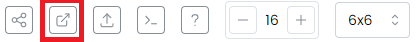

# Three.js Overview

Three.js is a JavaScript library that provides a simplified API for creating and displaying 3D graphics in web applications. It's built on top of WebGL, a low-level graphics API that's part of the HTML5 standard, which allows for hardware-accelerated rendering of 3D graphics in the browser.

# Using the Bulut Bilişimciler Three.js Environment:

A ready to use Three.js environment has been created for you. All you need to do is to edit the source file and view the changes in real time with your browser. You can use the terminal editor Vim to edit the source file.

`vim src/three.js`

Vim has two primary modes: COMMAND mode and INSERT mode. In COMMAND mode, you execute commands (like undo, redo, find and replace, quit, etc.). In INSERT mode, you type text. When you open a file for editing the editor will be in COMMAND mode by default.

Press i to enter INSERT mode and press ESC to go back to COMMAND mode.

## Saving and Quitting

All of the following commands must be typed while in COMMAND mode.

- `:w` saves a file
- `:q` quits Vim
- `:q!` quits without saving unsaved changes
- `:wq` saves the unsaved changes and then quits

## Viewing the scene

To view your scene press the button above the terminal panel on the right side of the screen indicated with a red box in the image below.

Then select node1 as the machine and type 3001 as the port.

Your scene will be rendered in the new tab. Don't forget to refresh this tab to see the changes.
