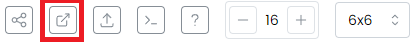

# Three.js'ye Genel Bakış

Three.js, web uygulamalarında 3B grafikler oluşturmak ve görüntülemek için basitleştirilmiş bir API sağlayan bir JavaScript kütüphanesidir. HTML5 standardının bir parçası olan ve tarayıcıda 3B grafiklerin donanımla hızlandırılmış olarak oluşturulmasına izin veren düşük seviyeli bir grafik API'si olan WebGL'nin üzerine inşa edilmiştir.

# Bulut Bilişimciler Three.js Ortamını Kullanmak:

Kullanıma hazır bir Three.js ortamı, sizin için oluşturuldu. Tek yapmanız gereken kaynak dosyayı düzenlemek ve değişiklikleri tarayıcınızla gerçek zamanlı olarak görüntülemek. Kaynak dosyayı düzenlemek için Vim terminal düzenleyicisini kullanabilirsiniz.

`vim src/three.js`

Vim'in iki ana modu vardır: COMMAND modu ve INSERT modu. COMMAND modunda, komutları yürütürsünüz (geri al, yeniden yap, bul ve değiştir, çık, vb.). INSERT modunda metin yazarsınız. Bir dosyayı düzenlemek için açtığınızda, düzenleyici varsayılan olarak KOMUT modunda olacaktır.

INSERT moduna girmek için "i" tuşuna basın ve COMMAND moduna geri dönmek için ESC tuşuna basın.

## Kaydetmek ve Çıkmak

Aşağıdaki komutların KOMUT modundayken yazılması gerekir.

- `:w` dosyayı kaydeder
- `:q` Vim'den çıkar
- `:q!` yapılan değişiklikleri kaydetmeden çıkmak için kullanılır
- `:wq` yapılan değişiklikleri kaydedip çıkmak için kullanılır.

## Sahneyi Görüntüleme

Sahnenizi görüntülemek için, aşağıdaki resimde kırmızı bir kutu ile gösterilen ekranın sağ tarafındaki terminal panelinin üzerindeki düğmeye basın.

Ardından, makine olarak node1'i seçin ve port olarak 3001 yazın.

Sahneniz yeni sekmede gosterilecektir. Değişiklikleri görmek için bu sekmeyi yenilemeyi unutmayın.
